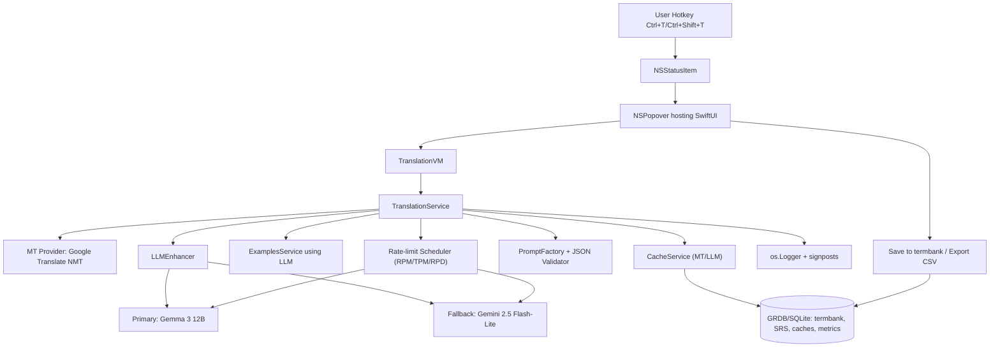

## Menubar Translator — Planning v1

Sources: `proj_docs/translate_assist_prd_v_0.md` (PRD), `proj_docs/translate_assist_product_management_requirements_pmr_v_0.md` (PMR), Apple Dev Docs (Swift, SwiftUI, AppKit, GRDB, URLSession).

### Clarifications locked
- API keys via `Secrets.plist` + env overrides. You will provide a Gemini API key (Google AI Studio).
- LLM policy: primary `gemma-3-12b` (configurable model id), fallback `gemini-2.5-flash-lite`.
- Storage: single GRDB/SQLite DB for termbank, caches, metrics.
- Updates: Sparkle excluded in MVP (no in-app updates).
- Hotkey: default `Ctrl+T` or `Ctrl+Shift+T`; user-changeable later.
- Examples: fetch on demand.
- MVP: no TTS/audio controls (hide); IPA text allowed. Show MT first; never block UI for LLM.

### Model & rate-limit policy
- Providers: swappable via adapters. Implement `GemmaLLMProvider` (supports Groq or Google endpoints) and `GeminiLLMProvider` (Google AI Studio). Select at runtime by config.
- Token-bucket scheduler per model using RPM/TPM/RPD ceilings. Respect `Retry-After` and any `x-ratelimit-*` headers. Global FIFO prioritizes popover actions over background tasks.
- Free-tier limits: read from official docs at runtime if available; otherwise use environment-configured defaults.
  - Env/config keys (set once keys are provisioned):
    - `GEMMA3_MODEL_ID` (default `gemma-3-12b`), `GEMMA3_RPM`, `GEMMA3_TPM`, `GEMMA3_RPD`
    - `GEMINI_MODEL_ID` (default `gemini-2.5-flash-lite`), `GEMINI_RPM`, `GEMINI_TPM`, `GEMINI_RPD`
- Circuit-breaker: on repeated 429/503 or JSON invalidation → disable LLM for 60s and run MT-only; auto-recover.

### Target architecture
- UI: SwiftUI views inside AppKit `NSPopover` via `NSStatusItem`. Views thin; ViewModels own logic. Popover close cancels in-flight tasks.
- Persistence: GRDB/SQLite single DB: termbank, SRS, caches, metrics; deterministic migrations; JSONL/CSV exports.
- Networking: `URLSession` with per-request timeouts, request IDs, structured logs (`os.Logger`), `os_signpost` around stages.
- Providers (adapters): `GoogleTranslationProvider`, `GemmaLLMProvider`, `GeminiLLMProvider`.
- Services: `TranslationService`, `LLMEnhancerService`, `ExamplesService (LLM-generated; no external datasets)`, `CacheService`, `CSVExportService`.
- PromptFactory: centralize rerank/rewrite/explain prompts. No inline prompts.
- JSON validation: strict schema, single compact “repair” retry; else fallback to MT-only with banner.

### Environment configuration (quotas and keys)
- LLM
  - `GEMMA3_MODEL_ID=gemma-3-12b`
  - `GEMMA3_RPM`, `GEMMA3_TPM`, `GEMMA3_RPD`
  - `GEMINI_MODEL_ID=gemini-2.5-flash-lite`
  - `GEMINI_RPM`, `GEMINI_TPM`, `GEMINI_RPD`
  - `GEMINI_API_KEY`
- MT (Google Translate — general NMT)
  - `GOOGLE_TRANSLATE_API_KEY`
  - `GOOGLE_TRANSLATE_RPM`, `GOOGLE_TRANSLATE_CPM`, `GOOGLE_TRANSLATE_CPD`
- Shared
  - `REQUEST_TIMEOUT_MS`, `SCHEDULER_BURST_SIZE`, `CIRCUIT_BREAKER_COOLDOWN_MS`
  - `CACHE_MT_TTL_S`, `CACHE_LLM_TTL_S`

### Secrets and key management
- Bootstrap: read `Secrets.plist` on first run for `GEMINI_API_KEY` and `GOOGLE_TRANSLATE_API_KEY` if present.
- Migration: when user edits keys in Settings, persist to Keychain; prefer Keychain on subsequent launches.
- Never log full keys; mask except last 4 chars. No secrets in repo or logs.

### Networking endpoints and request examples
- Gemini/Gemma (text-only generate):
  - Endpoint: `POST https://generativelanguage.googleapis.com/v1beta/models/{MODEL_ID}:generateContent`
  - Headers: `Content-Type: application/json`, `X-goog-api-key: $GEMINI_API_KEY`
  - Example (Gemini Flash-Lite):
    ```bash
    curl "https://generativelanguage.googleapis.com/v1beta/models/gemini-2.5-flash-lite:generateContent" \
      -H 'Content-Type: application/json' \
      -H "X-goog-api-key: $GEMINI_API_KEY" \
      -X POST \
      -d '{
        "contents": [{ "parts": [{ "text": "Explain how AI works in a few words" }] }]
      }'
    ```
  - Primary model: set `{MODEL_ID}` from `GEMMA3_MODEL_ID` (e.g., `gemma-3-12b`) when available via API; otherwise route to your chosen provider endpoint.
- Google Translate (general NMT):
  - Endpoint (v2): `POST https://translation.googleapis.com/language/translate/v2`
  - Headers: `Content-Type: application/json`
  - Query/Auth: `key=$GOOGLE_TRANSLATE_API_KEY`
  - Body example:
    ```json
    {
      "q": ["Hello, world!"],
      "target": "fa",
      "source": "en",
      "format": "text",
      "model": "nmt"
    }
    ```
  - Response mapping: extract `data.translations[].translatedText`; detected source if provided.

### Rate-limit scheduler design (token-bucket)
- Per provider, maintain buckets for RPM and TPM/characters. Global FIFO queue prioritizes popover requests.
- Respect response headers `retry-after` and any `x-ratelimit-*` hints.
- Pseudocode:
```text
onRequest(provider):
  now = clock()
  refillTokens(provider, now)
  if tokens < cost: enqueue(request); schedule when tokens available
  else: consume tokens; dispatch with timeout; attach requestId

on429or503(resp):
  backoff = min(cap, base * 2^attempt + jitter)
  if retry-after: sleep(retry-after) else sleep(backoff)
  if consecutiveFailures > threshold: tripCircuit(provider, 60s)

onCircuitOpen(provider): use MT-only path; show banner; auto-close after cooldown or capacity observed
```

### Failure modes and handling
- Invalid LLM JSON → repair once; if fail, switch to MT-only and show a compact banner.
- 429/503/rate limits → exponential backoff with jitter; respect `retry-after`; trip LLM circuit-breaker for 60s; auto-recover.
- Offline → serve cached results with “Offline—showing cache” banner.
- Persistent quota exhaustion → queue + fallback to MT-only with banner.
- DB transient errors → in-memory fallbacks for the session; log and surface minimal UI error if persistent.

### Architecture diagram


### Data model (Schema v1, GRDB)
- `term(id, src, dst, lemma, created_at)`
- `sense(id, term_id, canonical, variants, domain, notes, style, source, confidence, created_at)`
- `example(id, term_id, src_text, dst_text, provenance, created_at)`
- `review_log(id, term_id, due_at, ease, interval, success, created_at)`
- `cache_mt(key primary, payload, created_at, ttl)`
- `cache_llm(key primary, payload, created_at, ttl)`
- `metrics(id, event, value, created_at)`

### Contracts (protocols)
- `TranslationProvider.translate(term:src:dst:context:) -> MTResponse`
- `LLMEnhancer.rerank(input:) -> RerankOutput`
- `LLMEnhancer.rewrite(input:) -> RewriteOutput`
- `LLMEnhancer.explain(input:) -> ExplainOutput`
- `ExamplesProvider.search(term:src:dst:context:) -> [Example]`
- `GlossaryProvider.find(term:domain:) -> [GlossaryHit]`
- `MetricsProvider.track(event:value:)`

### Strict LLM JSON (validator target)
{
  "version": "1.0",
  "decision": "mt" | "rewrite" | "reject",
  "top_index": 0,
  "rewrite": "string|null",
  "explanation": "string",
  "confidence": 0.0,
  "warnings": ["string"]
}

### Phased plan and step-by-step tasks

#### Phase 0 — Project bootstrap ✅
- Create `Secrets.plist` (placeholders) and env override loader.
- Add `Config/Constants.swift` for timeouts, UI limits; `Config/RateLimitConfig.swift` for model quotas.
- Add `.gitignore`, `README.md`; set up SPM if needed.
- Acceptance: app builds; menu bar icon shows; empty popover opens.

#### Phase 1 — Storage & migrations (GRDB) ✅
- Add DB stack, deterministic migrations for Schema v1.
- Implement DAOs and typed models; monthly vacuum job.
- Export/import: JSONL (termbank/examples), CSV export for senses.
- Acceptance: migrations run; CRUD ok; export/import verified.

#### Phase 2 — Protocols, errors, fakes ✅
- Define all provider protocols and typed domain errors → user-safe messages.
- Implement fake providers for previews/tests.
- Acceptance: compiles; previews render with canned data.

#### Phase 3 — Networking, logging, scheduler ✅
- `NetworkClient` with `URLSession`, request IDs, `os.Logger` (structured), `os_signpost`.
- Token-bucket limiter per model; headers-aware backoff; 60s circuit-breaker.
- Acceptance: synthetic load test shows queueing/backoff; logs include rate-limit snapshots.

#### Phase 4 — Cache services ✅
- MT cache: key `(term, contextHash, src→fa)`.
- LLM cache: key `(term, contextHash, personaHash, mtHash)`.
- TTL per entry; eviction; monthly vacuum.
- Acceptance: cache hits ≤300ms; TTL expiry works.

#### Phase 5 — Providers (adapters) (⚠️ test required)
- `GoogleTranslationProvider`: detect EN/ES/ZH/HI/AR → FA; candidates list; quotas surfaced.
- `GemmaLLMProvider`: configurable endpoint (Groq/Google/other) with model id `gemma-3-12b` by default.
- `GeminiLLMProvider`: AI Studio `gemini-2.5-flash-lite`.
- PromptFactory; strict JSON; validator + one repair; fallback to MT-only on failure.
- Acceptance: happy-path MT+LLM within budgets; invalid JSON → repair once → else fallback + banner.

#### Phase 6 — Orchestration services ✅
- `TranslationService`: MT → rerank → optional rewrite → explain → examples; cancellable; stream MT first.
- `ExamplesService`: Tatoeba/Wiktionary fetch-on-demand with provenance labels; cached.
- `CSVExportService`, `GlossaryProvider` (stub initially, bias rerank when hit).
- Acceptance: MT ≤800ms P95; LLM polish ≤400ms after MT P95.

#### Phase 7 — Menubar shell & hotkey ✅
- `NSStatusItem` + `NSPopover` hosting SwiftUI root; global hotkey `Ctrl+T` / `Ctrl+Shift+T`.
- RTL layout and accessibility labels; cancel in-flight on close.
- Acceptance: hotkey focuses input; accessibility reads header controls.

#### Phase 8 — Popover UI & interactions ✅
- Header: term, IPA (dim), POS, copy; audio controls hidden in MVP.
- Primary card: FA translation, domain badge, confidence dot.
- Alternatives: collapsed list.
- Chips: domain toggles; Persona presets (Engineer·Read, Business·Write, Casual·Learn).
- Quality toggles: Literal↔Idiomatic; Formal↔Conversational.
- Save to termbank; inline banners (offline, rate-limit, JSON invalid, glossary conflict).
- Acceptance: toggles trigger cached LLM updates ≤400ms P95; banners display appropriately.

#### Phase 9 — Termbank, SRS, history, export ✅
- Save current sense; last 5 input history.
- Light SRS: ≤10 daily review items.
- CSV/JSONL export with headers.
- Acceptance: save ≤50ms; review shows items; export valid UTF‑8.

#### Phase 10 — Resilience & offline
- Distinct banners: offline, provider busy/rate-limited, JSON invalid → MT-only.
- Retry button; auto-recover after cooldown or when headers show capacity.
- Acceptance: chaos tests (429/503, timeouts) degrade gracefully; no crashes.

#### Phase 11 — Testing & quality gates
- Unit tests: adapters (fakes), validators, caches, scheduler, persona logic, SRS math.
- UI tests: selection → popover → save; toggles; RTL rendering.
- Gold set: 100 items (AI/CS 50, Business 50); log wins/losses MT-only vs MT+LLM; P50/P95 latencies.
- Acceptance: tests green; ≥80% “Right meaning”; budgets met.

#### Phase 12 — Packaging & distribution
- Assets, light/dark + RTL previews; About with attributions (Wiktionary/Tatoeba).
- Signed and notarized DMG distribution; no Sparkle in MVP.
- Acceptance: notarization OK; DMG installs on a second machine.

### Acceptance criteria (MVP)
- First visible MT ≤800ms (P95); cache first paint ≤300ms; LLM enhancement ≤400ms after MT (P95).
- Fallback to MT-only on any invalid JSON or 429/503 (with banner). Auto recovery after cooldown.
- Unified DB persists termbank, examples, caches, metrics; export/import works.
- Accessibility & RTL verified; crash-free ≥99% in testing; previews compile with mocks.

### Risks & mitigations
- Latency spikes → small models, caching, scheduler; show MT first.
- JSON drift → strict schema, repair, MT-only fallback.
- RTL quirks → explicit tests; semantic attributes.
- Quotas → headers-aware limiter; circuit-breaker; user-visible banners.

### Immediate next steps
1) Implement Phase 0 (bootstrap, configs, Secrets loader).
2) Implement Phase 1 (GRDB schema v1 + migrations + DAOs).
3) Add RateLimit scheduler skeleton with env-configured defaults; wire into providers.


